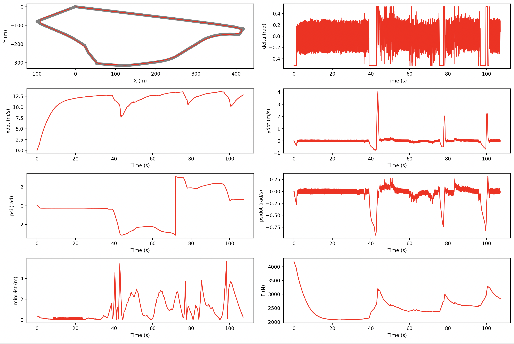
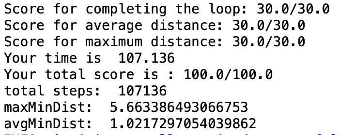
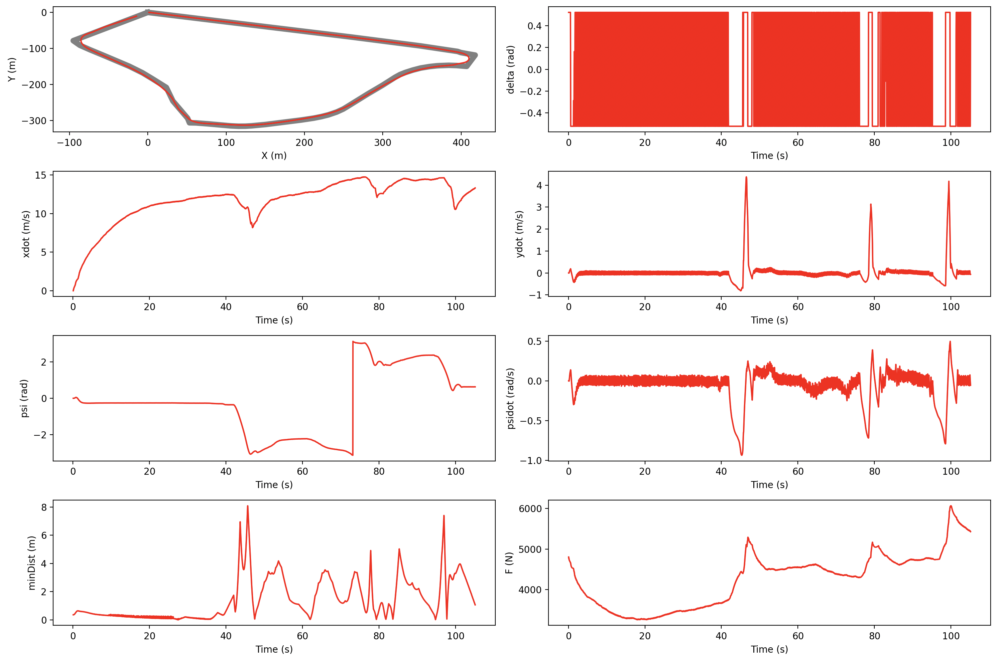

# Modern Control Theory | Modern Control For Robotics
### CMU 24677 - Project Demos

In this class, we were tasked with developing our own controllers to enable a car to complete a trajectory in a [Webot](https://cyberbotics.com/) simulation environment. I develoepd 5 different controls (PID, LQR, ...) for the Tesla to complete the path as fast as possible while meeting the acchracy requirements. Through the projects, I was able to deepen my understanding of different control systems and their applications in autonomous vehicles.

## Unoptimized Simulation
Simulation of an unoptimized run to compare against runs with custom controllers.
<video width="380" height="250" controls>
  <source src="unoptimized.mp4" type="video/mp4">
</video>

## P1 : PID Control
> Requirements: 
>> Runtime: < 400s  
>> Maximum Distance from Path:10  
>> Maximum Avg Distance from Path: 5

<video width="380" height="250" controls>
  <source src="p1/PID.mp4" type="video/mp4">
</video>

## P2 : LQR
> Requirements:
>> Runtime: < 350s  
>> Maximum Distance from Path: 9  
>> Maximum Avg Distance from Path: 4.5

<video width="380" height="250" controls>
  <source src="p2/lqr.mp4" type="video/mp4">
</video>

