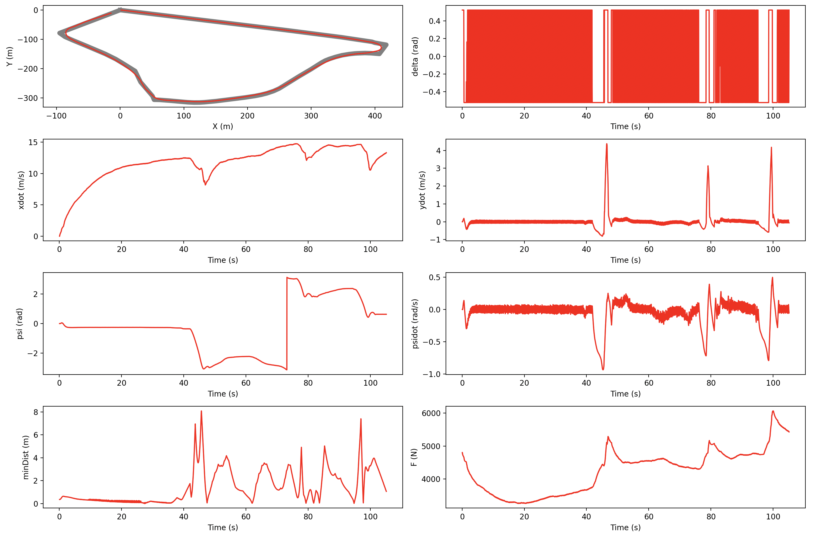
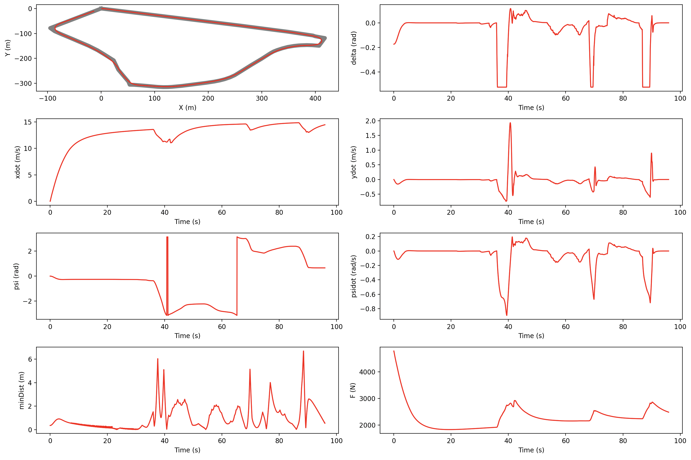
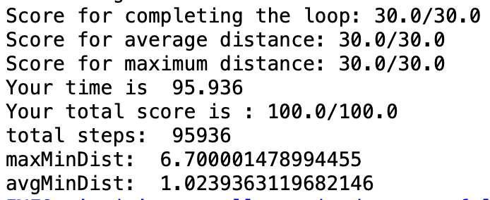
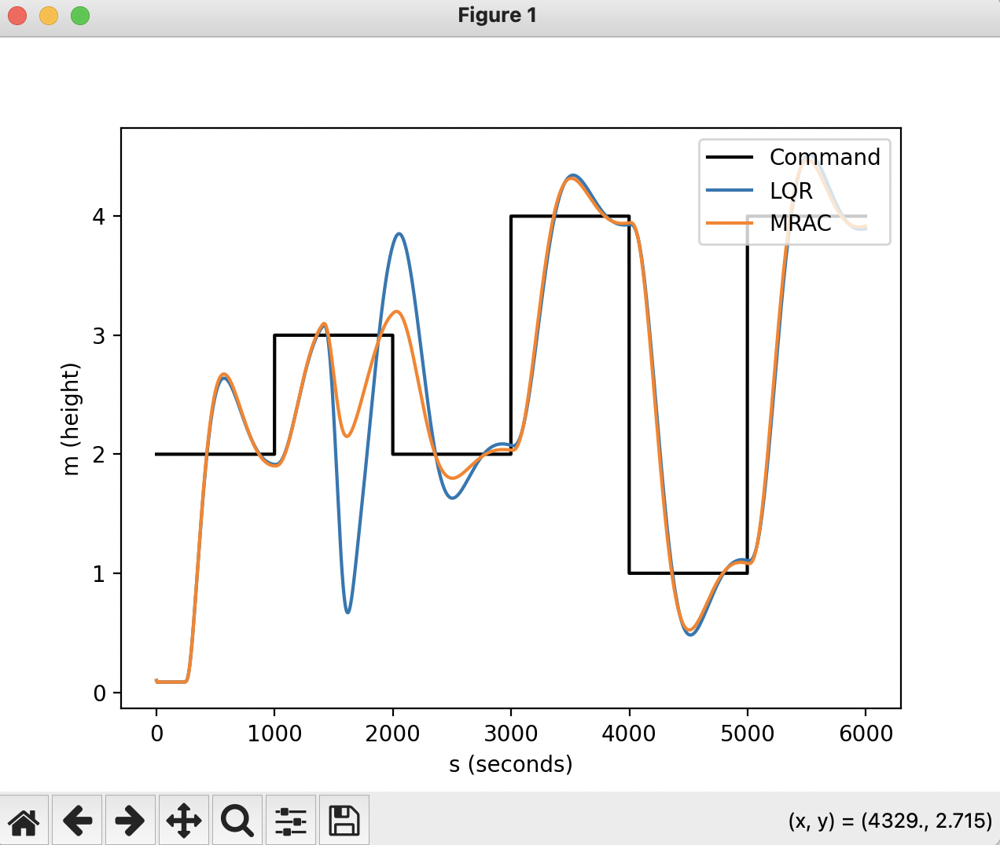

# Modern Control Theory | Modern Control For Robotics
### CMU 24677 - Project Demos

In this class, we were tasked with developing our own controllers to enable a Tesla to complete a path in a [Webot](https://cyberbotics.com/) simulation environment. I develoepd 5 different controls (PID, FSF, LQR, ...) for the Tesla to complete the path as fast as possible while meeting the accuracy requirements. Through the projects, I was able to deepen my understanding of different control systems and their applications in autonomous vehicles.

## Unoptimized Simulation
Simulation of an unoptimized run to compare against runs with custom controllers.

[Watch the unoptimized simulation on YouTube](https://www.youtube.com/watch?v=LSsvH2R49dw)

## P1 : PID Control
> Requirements: 
>> Runtime: < 400s  
>> Maximum Distance from Path:10m  
>> Maximum Avg Distance from Path: 5m

[Watch the PID control simulation on YouTube](https://www.youtube.com/watch?v=98Yn8yShmd8)

## P2 : Full State Feedback Control
> Requirements:
>> Runtime: < 350s  
>> Maximum Distance from Path: 9m  
>> Maximum Avg Distance from Path: 4.5m

[Watch the FSF control simulation on YouTube](https://www.youtube.com/watch?v=o_HNBtnbN30)

## P3 : LQR
> Requirements:
>> Runtime: < 250s  
>> Maximum Distance from Path: 7.0m 
>> Maximum Avg Distance from Path: 3.5m

[Watch the LQR control simulation on YouTube](https://www.youtube.com/watch?v=O3-dlC_X07o)

## P5 : MRAC (Model Reference Adaptive Controller)
> Developed a MRAC, LQR control for a drone that recovers from 65% thrust loss in one of the motors

[Watch the MRAC drone control simulation on YouTube](https://www.youtube.com/watch?v=KfT4UupcHBs)

